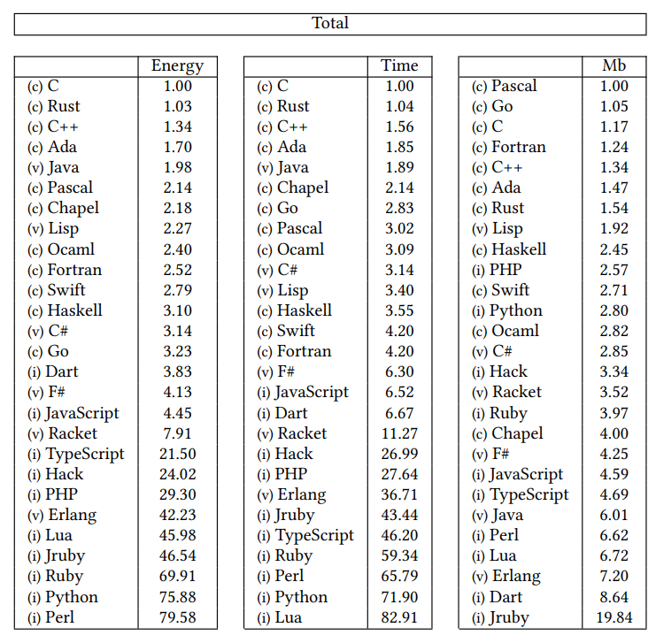
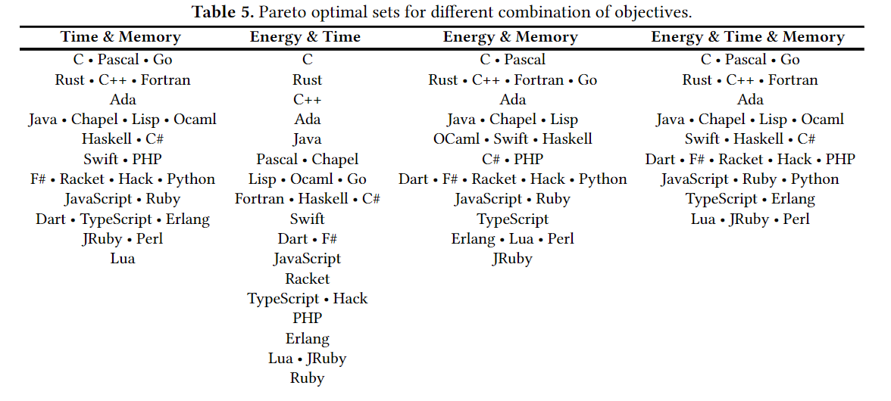

# 为什么学c/c++
## 1. 跨平台
    c/c++ 的跨平台与 python/js/java 的跨平台不一样。python/js 的解释器，java 的虚拟机相当于是一个抽象层，
    将系统抽象出来（这个抽象引入了性能成本）。c/c++ 的跨平台是通过重新编译获得的， 代码被直接编译成机器码。
    直接运行在 cpu 上，没有中间商赚差价。 注解：c++ 是支持跨平台编译的，c 语言本身也是支持跨平台编译的，
    但是 c 代码通常会调用系统接口，因此导致 c 跨平台性差一点。但是 linux c 代码通过一些包装层（cygwin，mingw）
    是可以跨平台在 windows 系统上编译运行的。
## 2. 性能
### 2.1 游戏，金融，科学计算等高算力场景；
    实时性要求较高，通常不计成本投入
### 2.2 低成本硬件（内存，cpu）解决方案
    物联网-嵌入式。
    解释器，虚拟机的运行成本。
### 2.3 cpu 性能增长受阻
    摩尔定律（集成电路上所能容纳下的元件数量，每18个月就会增加一倍。）。
**Intel cpu 发展历程及制造工艺** 
 
    2005年之后cpu单核性能停止提高。（摘自--现代c++白皮书）
    为提高算力，cpu核数量开始增加。但是性能与核数并不是线性增长关系。任务在多核之间的切换（造成大量的cache miss）
    调度以及锁的使用，使cpu的核数并不能无限制的增长，以满足人们对性能的贪婪。
    必须要找到一中在不提升硬件性能情况下，提升软件效率的解决方案。

## 3. 对硬件的直接操作能力
    单片机，嵌入式驱动，SIMD 等一些高级加速指令。（寄存器，内存）

## 4. 功耗 经济优势
    cpu 制程工艺越小->(功率功耗发热越低，工作频率越高->(性能越高))
    同一个算法实现，在占用 pc 更少资源（内存）的情况下，在更短的时间（ cpu 时钟周期）内完成则消耗的能量通常会更少。
    c/c++ 在更少 pc 资源，更快速运行方面，相比其他流行高级语言优势巨大。
    内存成本，能耗成本。内存成本可以通过运行次数摊薄，但是能耗成本，只要程序运行就要投入（无底洞）。
    1.节能助力碳中和；
    2.节能提升移动端设备的续航；
    3.节能是笔经济账（对于服务器端是有巨大收益的。东数西算-选址贵州，很大一部分原因是电力成本）；

    可以精确量化到，每度电对应多少 bit 算力（挖矿）
    蓝海野蛮增长，红海就要控制成本。（互联网毕业潮）

[参考文献 Energy Efficiency across Programming Languages ](./sleFinal.pdf)  
**能耗，速度，内存消耗对比图** 
 
**帕累托最优对比图** 
 

**语言类型性能对比**
| 编程语言类型 | 时间 | 功耗 | 内存消耗 |
| :---------: | ---: | --: | ------: |
| 编译语言 | 5103ms | 120J | 125Mb |
| 虚拟机语言 | 20623ms | 576J | 285Mb|
| 解释型语言 | 87614ms | 2365J | 426Mb|

## 5. 生态
    c 在上世纪70年代诞生蓬勃发展了50多年，使其拥有庞大的社区和数不清的开源项目。c++ 完全继承了 c 的语法（所有的 c 项目都可以被 c++ 项目 0 成本的使用）同时也继承了 c 语言的社区。大家所熟知的 python 的解析器，就是 c 语言编写的。nodejs 完全由c/c++编写。java 的很多生态都是由 c/c++ 通过 JNI 实现的跨语言调用。
